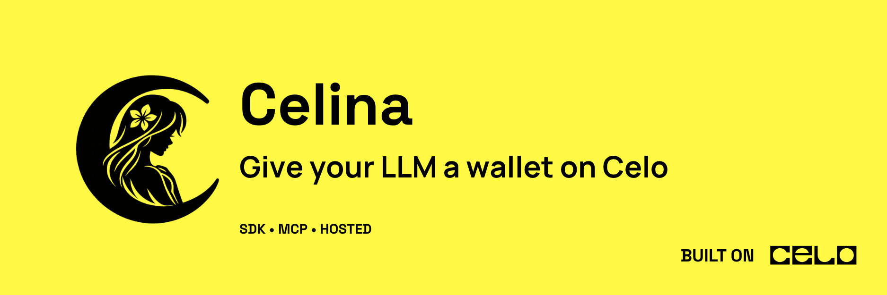

<p align="center">
  
</p>

# Celina — marketing site

**Celina** is an open-source agent stack for **Celo mainnet** — one shared tool catalog from [`@andrewkimjoseph/celina-sdk/tools`](https://www.npmjs.com/package/@andrewkimjoseph/celina-sdk) that powers MCP clients, the hosted endpoint, and browser wallet apps.

- Website: [usecelina.xyz](https://usecelina.xyz)
- SDK: [@andrewkimjoseph/celina-sdk](https://www.npmjs.com/package/@andrewkimjoseph/celina-sdk) — reads, wallet signing flows, `/simulation` for revert-before-send, and the shared LLM tool catalog
- MCP: [@andrewkimjoseph/celina-mcp](https://www.npmjs.com/package/@andrewkimjoseph/celina-mcp) — registers the catalog for IDE / CLI agents
- Hosted endpoint: `https://mcp.usecelina.xyz/api/mcp` — **34 tools** (reads + quotes + AgentKarma reputation; no `estimate_*` or server-key writes). Public read-only — no API key; see [celina-mcp-host SECURITY.md](../celina-mcp-host/SECURITY.md).
- Celeste AI: [celeste.usecelina.xyz](https://celeste.usecelina.xyz) — reference browser wallet chat UI (SDK + wagmi, not MCP)
- Full stdio catalog: **54 tools** (adds `execute_gooddollar_reserve_swap`, and other server-key execute/write paths)

This repo is the **marketing site** for Celina. The SDK and MCP packages live in sibling directories in the monorepo.

## Site

- **Landing page** (`/`) — hero, stack teaser, demo, principles, and tool teaser
- **Stack** (`/stack`) — architecture diagram and product cards (SDK, MCP, hosted endpoint, Celeste AI)
- **About** (`/about`) — mission, architecture, ecosystem links (SDK, MCP, hosted endpoint, Celeste AI)
- **MCP hub** (`/mcp`) — MCP overview, local vs remote comparison
  - **Local stdio** (`/mcp/local`) — npx install and client config
  - **Remote hosted** (`/mcp/remote`) — Streamable HTTP endpoint and `mcp-remote` bridge
- **SDK page** (`/sdk`) — SDK deep-dive: shared tool catalog, programmatic client, and integration paths
- **Tools catalog** (`/tools`) — browse all MCP tools by category
  - Category pages: `/tools/blockchain`, `/tools/mento-fx`, `/tools/uniswap`, `/tools/aave`, `/tools/gooddollar` (UBI + reserve quote), `/tools/self`, and more
  - Individual tool docs: `/tools/:category/:toolSlug`
- **Stats dashboard** (`/stats`) — on-chain activity (Dune), off-chain MCP tool calls and wallets queried (Amplitude → Supabase), and npm downloads

## Stack

- TanStack Start v1 (React 19, Vite 7)
- Tailwind CSS v4 (design tokens in `src/styles.css`)
- Cloudflare Workers (via `@cloudflare/vite-plugin`)
- TanStack Query for data fetching
- Zustand for client state

## Project structure

```
src/
  routes/           # TanStack file-based routes
    index.tsx       # Landing page — full stack hub
    about.tsx       # About — mission, architecture, ecosystem
    mcp.tsx         # MCP layout + sub-nav
    mcp.index.tsx   # MCP overview
    mcp.local.tsx   # Local stdio install
    mcp.remote.tsx  # Remote hosted endpoint
    sdk.tsx         # SDK + tool catalog page
    tools.index.tsx # Tools catalog
    tools.$category.index.tsx    # Category pages
    tools.$category.$toolSlug.tsx # Tool detail pages
    stats.tsx       # Stats layout + sub-nav
    stats.index.tsx # Stats overview
    stats.onchain.tsx
    stats.offchain.tsx
    stats.package.tsx
  components/       # Reusable UI (SiteHeader, etc.)
  data/tools.ts     # Tool definitions (54 stdio catalog tools, 34 hosted)
  data/mcp.ts       # MCP config snippets and URLs
  lib/              # Stores, helpers, server functions
  styles.css        # Tailwind v4 + custom tokens
```

## Develop

```bash
bun install
cp .env.example .env.local   # optional — required for live /stats data locally
bun run dev
```

Route files live in `src/routes/`. TanStack Router auto-generates `src/routeTree.gen.ts` — do not edit it manually.

### Environment variables

Stats pages call server functions that need API keys. Without them, dashboards still render but show a “missing config” error instead of live data.

| Variable | Used for |
|----------|----------|
| `DUNE_API_KEY` | On-chain activity API auth (`/stats/onchain`) |
| `DUNE_QUERY_ID` | Dune query ID for on-chain stats fetch and dashboard link (required with `DUNE_API_KEY`) |
| `AMPLITUDE_API_KEY` / `AMPLITUDE_SECRET_KEY` | Off-chain MCP tool calls (`/stats/offchain`) |
| `AMPLITUDE_REGION` | Optional — `us` (default) or `eu` |
| `CUSTOM_SUPABASE_URL` / `CUSTOM_SUPABASE_SERVICE_ROLE_KEY` | Amplitude export cache in Supabase |
| `CRON_SECRET` | Vercel Cron auth for `/api/cron/amplitude-sync` (Amplitude export sync) |

- **Local (Vite):** copy [`.env.example`](.env.example) to `.env.local` or `.env`
- **Cloudflare Workers:** copy [`.dev.vars.example`](.dev.vars.example) to `.dev.vars`, or set secrets in the dashboard
- **Vercel:** project → Settings → Environment Variables (same names)

Manual Amplitude sync (e.g. cron debugging): `node scripts/run-amplitude-sync.mjs` reads `.env.local` then `.env`.

**Supabase setup (one-time):** after deploying off-chain stats changes, run [`scripts/supabase-amplitude-aggregates.sql`](scripts/supabase-amplitude-aggregates.sql) in the custom Supabase SQL editor (plus optional [`scripts/supabase-amplitude-user-id-index.sql`](scripts/supabase-amplitude-user-id-index.sql)). Production sync runs on Vercel Cron daily at midnight UTC (`/api/cron/amplitude-sync`); use `node scripts/run-amplitude-sync.mjs` for manual runs.

Never commit real keys. `.env`, `.env.local`, and `.dev.vars` are gitignored; only the `*.example` templates are tracked.

## Connect Celina to your agent

### Local stdio (recommended)

Full catalog with execute/write when you set `CELO_PRIVATE_KEY`. Keys stay on your machine.

```json
{
  "mcpServers": {
    "celina-mcp": {
      "type": "stdio",
      "command": "npx",
      "args": ["-y", "@andrewkimjoseph/celina-mcp"],
      "env": {
        "CELO_PRIVATE_KEY": "0x...",
        "SELF_AGENT_PRIVATE_KEY": "0x..."
      }
    }
  }
}
```

### Hosted (reads only)

No install, no keys — chain reads and chain reads:

```json
{
  "mcpServers": {
    "celina-mcp": {
      "url": "https://mcp.usecelina.xyz/api/mcp"
    }
  }
}
```

Never send private keys to the hosted endpoint. Self registration sessions are unreliable on serverless — use local stdio for Self Agent ID lifecycle flows.

### Local stdio via bridge

For stdio-only clients that cannot use Streamable HTTP directly, bridge to the hosted endpoint with `mcp-remote`:

```json
{
  "mcpServers": {
    "celina": {
      "command": "npx",
      "args": [
        "-y",
        "mcp-remote",
        "https://mcp.usecelina.xyz/api/mcp",
        "--transport",
        "http-only"
      ]
    }
  }
}
```

- `CELO_PRIVATE_KEY` — required for **write** tools (send tokens, swaps, Aave supply/withdraw, server-key execute tools). On local stdio, many reads accept an omitted `address` / `wallet_address` and default to this signer; use **`get_wallet_address`** when the agent needs the address as data.
- `SELF_AGENT_PRIVATE_KEY` — required for **Self Agent** registration and verification tools

Never commit private keys.

### Browser wallet apps

Apps that use **`surface: "browser"`** from `@andrewkimjoseph/celina-sdk/tools` pass the connected wallet on every call — no MCP server, no server keys. See the SDK page (`/sdk`) and [tool catalog guide](https://andrewkimjoseph.gitbook.io/celina-sdk/guides/tool-catalog).

## License

MIT
